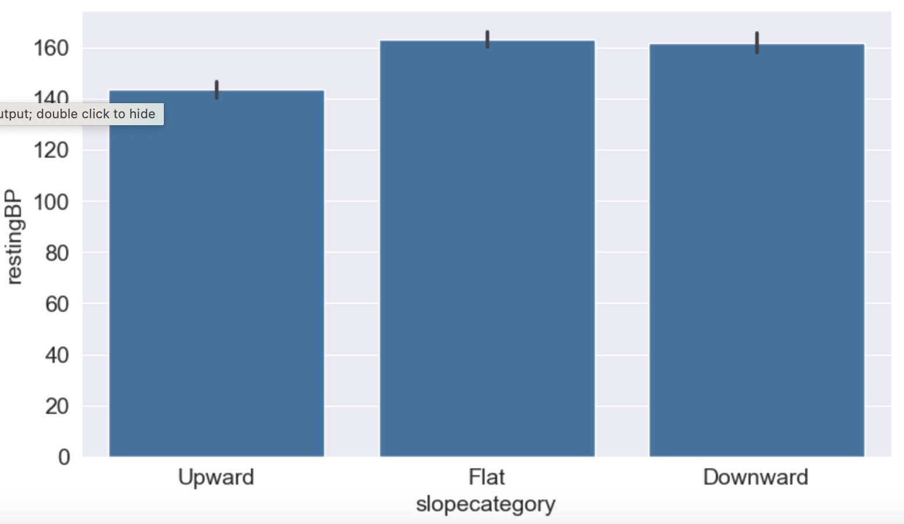

# Data Analysis Project - Cardio Vascular Disease Dataset

By: Liz Wilson
February 6, 2024

## *Cleaning, Analyzing, Discovering, and Predicting*

<a href="https://www.freepik.com/free-photo/human-heart-design_879663.htm#query=cardiovascular&position=1&from_view=keyword&track=sph&uuid=fd1cdd29-f844-4d93-8aa8-4274b9e62a94">Image by kjpargeter</a> on Freepik

---
## About Cardiovascular Disease
Cardiovascular disease (CVD) refers to a class of disorders that affect the heart and blood vessels, often leading to significant health implications. This broad category encompasses conditions such as coronary artery disease, heart failure, stroke, and peripheral artery disease, among others. Cardiovascular diseases arise from a complex interplay of genetic, lifestyle, and environmental factors, making them a leading cause of morbidity and mortality worldwide.

The primary culprit behind CVD is the accumulation of fatty deposits, cholesterol, and other substances in the arteries, a process known as atherosclerosis. This build-up can restrict blood flow to vital organs, increasing the risk of complications like heart attacks and strokes. Lifestyle choices, including diet, physical activity, smoking, and excessive alcohol consumption, can significantly influence the development and progression of cardiovascular diseases.

## The Project
The goal of this project is to do exploratory data analysis and visualization of the data and to ask and answer several questions about the data set. In addition, a logistic regression model will be built that will predict whether an individual has CVD or does not have CVD based on their test results.  

The project is contained within this [Jupyter Notebook](CVD_Analysis_Project.ipynb).  The data will be imported from Kaggle, saved as a Pandas data frame, and various libraries will be utilized to accomplish the data analysis and the prediction model. The project is being completed as part of the course [Data Analysis with Python: Zero to Pandas](https://jovian.com/learn/data-analysis-with-python-zero-to-pandas).

### The Dataset
The dataset that will be analyzed is a cardio vascular dataset with 1000 rows, each representing a different patient and 14 features about that patient. The dataset is from [Kaggle](https://www.kaggle.com/datasets/jocelyndumlao/cardiovascular-disease-dataset/data) and the data originates from a hospital in India. 

### Data Preparation and Cleaning
* There were a number of 0 values for cholesterol so those values were replaced with NaN values so that 0 would not be mistaken for a valid value
* There were missing and invalid data for slope so those rows were removed
* There were no duplicate rows
* After cleaning, the dataset contained 767 unique rows

### Exploratory Data Analysis
* First task is to classify each of our variables as numeric or categorical.  Additional analysis was done for the number of major vessels and chest pain variables. 
* The histograms of the numeric variables reveal that a number of them are not normally distributed (which will cause issues when the logistic regression model is built)
* The pairwise correlation matrix reveals that several variables are highly correlated with the target variable (slope, resting blood pressure, and resting electrocardiogram results).  We also see that we have some significant correlations between non-target variables (oldpeak and gender, chest pain and slope, and number of major vessels and slope).

### Questions and Data Discovery
#### Slope
Since slope is highly correlated with the target variable (correlation coefficient of 0.7) we explore the relationships with it extensively.  Below is some background on slope since it is an important variable in this dataset.  

The possible slope values are:
1-upsloping (normal)
2-flat (Flat T-waves are a relatively common finding in the general population, but they are often a sign of underlying cardiac disease)
3-downsloping (Exercise-induced downsloping ST-segment depression is a common manifestation of severe myocardial ischemia)

The slope refers to the ST segment depression which is a metric that is measured during an exercise tolerance test, [source](https://litfl.com/st-segment-ecg-library/).

#### Questions and Answers:
* Q: Does the prevalence for cardio vascular disease increase as a patient increases in age?
* A: This dataset doesn't demonstrate that cardio vascular disease prevalence increases with age.  This doesn't mean that we can conclude that CVD prevalence doesn't increase with age.  In this case we need more information on how the data was collected.  Perhaps individuals were selected to be included in the dataset BECAUSE they had cardio vascular disease or didn't have cardio vascular disease so that the counts would be somewhat similar in each category instead of choosing individuals at random.
* Q: Do patients with a worse value for slope tend to have a higher resting blood pressure?
* A: This dataset supports the hypothesis that individuals with an abnormal slope category (either Flat or Downward) when CVD is not considered have worse blood pressure readings on average than individuals with a normal slope category. 
* Q: What is the relationship between number of vessels and slope?
* A: This dataset demonstrates a very clear relationship between slope and number of major vessels. As number of major vessels increases the chance of a worse slope reading becomes more likely. Perhaps only including one of these variables in our model would be sufficient. It would be better to drop noofmajorvessels because slope is so highly correlated with `target`.
* Q: What is the difference in the mean fasting blood sugar level between the group with cardio vascular disease and the group without?
* A: The probability of having a high fasting blood sugar for the cardio vascular disease group is more than 3 times that of the non-diseased group.  This dataset supports the commonly known fact that diabetes is an important risk factor for cardio vascular disease. 
* Q: How does the slope value differ for the diabetic vs non-diabetic groups?
* A: Given an abnormal slope score (and knowing nothing else about the individual), that individual has about a 44-45% chance of being diabetic, about double the chance of an individual with a normal slope score
Given that an individual has cardio vascular disease, regardless of their slope score, they will still all have about a 40-50% chance of being diabetic (even if the slope score is normal).
* Q: Is there any difference in gender within the cardio vascular disease group and the non cardio vascular disease group?
* A: We see in our dataset that the probability of falling into the cardio vascular disease group is greater for males (0.72) than for females (0.60).
Our dataset confirms that the prevalence is higher for men than women, about 12% in this case.
Additional understanding of how individuals were selected to be included in this dataset is needed before any conclusions can be drawn.
* Q: What is the relationship between chest pain and slope?
* A: There appears to be a discrepancy between the data dictionary and the results that we are seeing in the analysis.  Assuming that the data dictionary is incorrect and a higher chest pain score is worse than a lower score (a higher score would mean that the pain was more indicative of angina and a 0 would mean no chest pain), this dataset supports the hypothesis that individuals with an abnormal slope category (either Flat or Downward) have worse chest pain scores than individuals with a normal slope category. For those who have been diagnosed with cardio vascular disease we see similar chest pain scores regardless of the slope category. 

### Predictive Model
* The data is split into training, validation, and testing datasets.
* A Logistic Regression model is fitted using Scikit Learn with the default solver of `'lbfgs`.  This does not converge because there are a number of variables that do not follow a standard normal distribution.  
* Scaling is utilized to solve this issue and a Logistic Regression model is able to be fit.
* If the model probability is greater than 0.5 then the individual is predicted to have CVD and less than or equal to 0.5 is predicted to not have CVD.
* The prediction accuracy when the model predictions are compared with the target of the validation dataset is 96.1%.
* The model is retrained on the full training dataset (including the validation data) and then compared with the test dataset.  This accuracy is 97.4%, similar enough to 96.1% that we are not concerned with overfitting.  The model is highly accurate.
